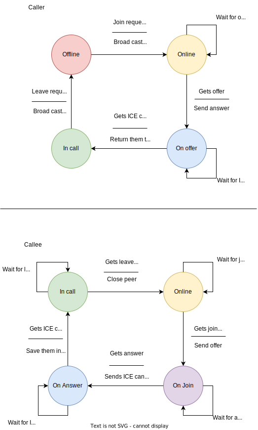

# WebRTC


Implementing a Video application with ```WebRTC```. In this project we are going to
use Javascript WebRTC modules and Websockets in order to create a communication system over video stream.
For our signaling server we are going to use ```Golang Fiber```.

## setup

In order to set up project you have two options. You can build it on your
own system (you need to have Golang installed on your system) or you can
start it on a container.

Build the project on your system:

```shell
go build -o main
chmod +x ./main
./main
```

### env

Set the project env variables to deploy it on production

```shell
HTTP_PORT=80 # project port
DEV_MODE=false # logging option
```

Run the project on container:

```shell
docker run --rm -it -d -p 80:80 $(docker build -q . -f build/Dockerfile)
```

After that you can access the application on ```localhost```.

## fsm

In the following schema you can see the application ```Finite State Machine```.
The process of making a call and joining a call is being handled like this.



## contribute

Feel free to submit you pull reqeusts on this repository.
